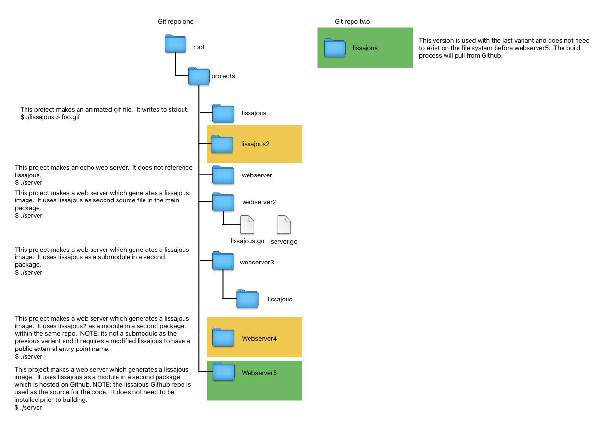
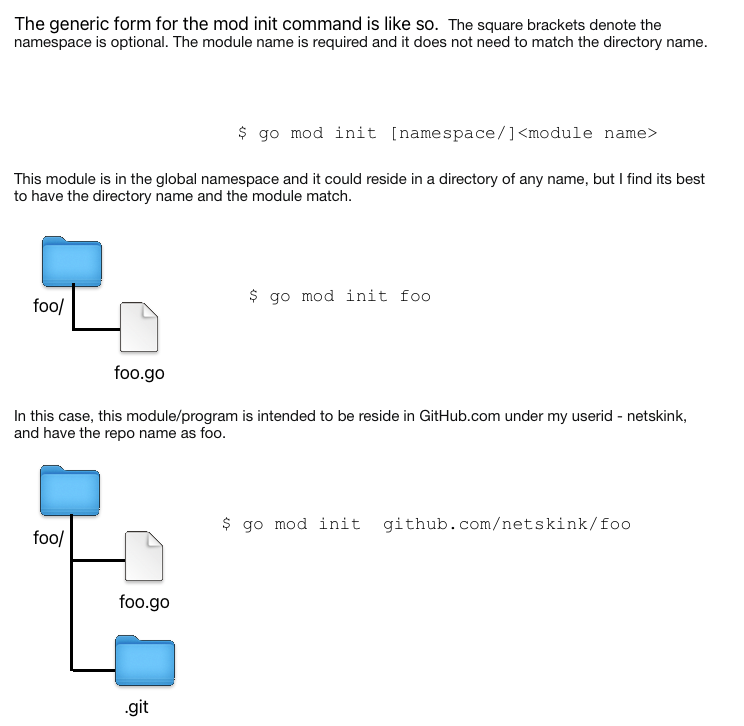

# Programs, Modules, Packages and Components in Go

## Overview

Each week our GDG (GDG Cloud RTP) hosts a weekly workshop where we study on a topic of interest.  During our work on learning Go, where we follow "The Go Programming Language" [book](https://www.gopl.io/) by Donovan and Kernighan, there is a section where they detail how to create a webserver that returns a Lissajous animated gif.   The section intends to use two different programs together to implement this capability.

We struggled with this part because we did not understand how this was it intended to be done.  As a result, this document explains the various steps to do so and captures the result of this learning exercise.

## Setup

The code for our workshops and this explanation reside in github.  

The discussion progressivly steps through different implementations starting with two source files in one program until a module is pulled from git.

The URLs are:
* [go workshop](https://github.com/rtp-gcp/go-testy)
    - This repo has all of the worked examples and exercises we have covered so far in the workshop.  For the purposes of this article on a few of the projects are of interest.
* [lissajous module](https://github.com/netskink/lissajous)
    - This repo  contains the [lissajous](https://en.wikipedia.org/wiki/Lissajous_curve) stand alone module for the final step in the discussion.

The following diagram shows the two repos and how they come into play.  The following sections describe the operation.



### Building go programs

Unlike C/C++ where you have a compile, link, run workflow, go has a few extra steps.  Namely, the `go mod init` and `go mod tidy` steps.

Before we get too deep into the implementation of the modules, here is a quick explantion of the build process.

When building go programs, here is the simplest sequence:

1. make changes to code
2. `go mod init somename`
3. `go mod tidy`
4. `go run .`

Regarding the somename parameter for mod init.  Here is how I think of it:

```
$ go mod init [namespace/]<module name>
```

The square brackets denote the namespace is optional. The module name is required and it does not need to match the directory name.

It's best demonstrated with examples.

```
$ go mod init foo
```

This module is in the global namespace and it could reside in a directory of any name, but I find its best to have the directory name and the module match.

```
$ go mod init github.com/netskink/foo
```

In this case, this module/program is intended to be reside in GitHub.com under my userid - netskink, and have the repo name as foo.

This and the associated directory structure is show in the figure.



### Standalone component 1 - the lissajous program

The lissajous program creates an animated .gif file that when opened shows a series of waveforms.  See here for example output.


This code resides in the git [here](https://github.com/rtp-gcp/go-testy/tree/main/projects/lissajous).

### Standalone component 2 - the webserver program

The webserver program responds to http requests on port 8000.  The base implementation [here](https://github.com/rtp-gcp/go-testy/tree/main/projects/s1.7_web_server3) simply returns text providing results regarding the client. It does not implement lissajous and is standalone.


## Integrating the two programs

### First Implementation - two source files in one directory

The first implementation is pretty simple.  It uses a single namespace with two source files in the same directory.  It is shown [here](https://github.com/rtp-gcp/go-testy/tree/main/projects/s1.7_web_server4b). 

In the diagram this is shown as webserver2.

The only mod to lissjous.go is that the main() routine is removed.

Although the webserver and lissajous components are in sepearate source files, the webserver does not need an import for lissajous since they both reside in the same namespace identified by the package main statement.

### Second Implementation - two source files in separate directories and namespaces

The second implmentation has the lissajous component in its own namespace with a differnt package statement.  It also resides in a subdirectory.  

In the diagram this is shows as webserver3.

The lissajous module can now have a main() since its own module distinct from the webserver3 in the parent directory.  However, the module needs a public entry point for use by the webserver program.  Consquently, the lissajous module implments a new Lissjous() routine which wraps the existing lissajous() routine.  The use of capital letters are how go implments public versus private.

The code for this example is [here](https://github.com/rtp-gcp/go-testy/tree/main/projects/s1.7_web_server4).

### Third Implementation - two programs in separate directories and namespaces

In this implementation the lissajous subdirectory module is moved to a new location in the project and renamed to lissajous2.  The lissajous code is otherwise unchanged.

The webserver code is essentially the same. The only difference is the module workflow regarding `go mod init` command and `go mod tidy` command requires a manual edit to rewrite the location of the module.  The readme in the webserver4 implementation provides detail on this process.

Here are the two components in reference:

* [lissajous2](https://github.com/rtp-gcp/go-testy/tree/main/projects/lissajous2)
* [webserver4](https://github.com/rtp-gcp/go-testy/tree/main/projects/s1.7_web_server5)


### Final Implementation - pulling the lissajous module from GitHub

In this final implmentation, the lissajous module is pulled from git.  We had a particular hard time with this because as we pushed changes to git for the lissajous module, it was not pulled down when building the webserver.  

This problem was allievated when we learned how to use version numbers and the `go get` command.

In this case, the webserver resides in the workshop project folder as all of the examples so far.  It is [here](https://github.com/rtp-gcp/go-testy/tree/main/projects/s1.7_web_server7ex1.12)

While the lissajous module resides in its own git repo which is [here](https://github.com/netskink/lissajous).

The diagram shows this as webserver5 and lissajous in green.

The code in either case is identical to the last iteration, its just that the go cli workflow is different.  Here is a summary:

### Building and publishing the lissajous module

1. make changes to code
2. git add lissajous.go
3. git commit -m "wip"
4. git push
5. git tag v1.0.x
6. git push origin v1.0.x

### Building the webserver and using last push of lissajous from git

1. make changes to code
2. go mod init github.com/netskink/webserver5
3. go get github.com/netskink/lissajous@v1.0.x
    - where the tag is whatever was last pushed in the lissajous repo
4. go mod tidy
5. [optional] go vet
5. go run .

## Vocabulary

My terms might not be correct golang, but here is an explantion for each.

* Program
    - A Go program which has a main().
* Components
    - Not a go lang term but a source file that implements a capability of a larger program.
* Modules
    - A proper Go source file implementing a component that can be imported.
* Packages
    - A collection of source files belonging to a namespace.


## References/URLs

* Official guide for modules is [here](https://go.dev/doc/tutorial/create-module).